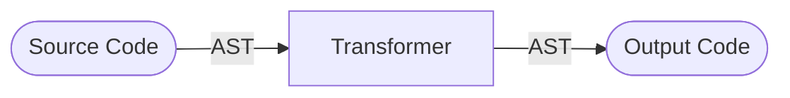

## Motivation

While working on a project, I had faced this situation in which I want to provide an API that'll by used by untyped code (like JavaScript).

This means that there are no guarantees on the parameter's values (that get passed to the API I'm providing) complying with the types I'm declaring.

Initially I would say _it's the consumer's fault not respecting the types_,
but for the project I'm working on it's both important for the API to be secure and for it to have clear error messages that help the consumers.

This meant that the values of the parameters have to be validated manually in runtime.

### The first solution that comes to mind

A simple solution that can come quickly to the mind is to write if statements checking the value's types and throwing errors for each function.

```typescript
function point(x: number, y: number, color?: number) {
    if (typeof x !== 'number') throw new Error(`bad argument #1 "x" to "point" (number expected, got ${typeof x})`);
    if (typeof y !== 'number') throw new Error(`bad argument #2 "y" to "point" (number expected, got ${typeof y})`);
    if (typeof color !== 'number') throw new Error(`bad argument #3 "color" to "point" (number or undefined expected, got ${typeof color})`);

    // ... (application code)
}
```

But that's clearly very repetitive, prune to human typing errors, hard to refactor and thus hard to maintain.

### Extract the repetitive code into a reusable function

To help make it better, it's possible to have the validation operation and the formatting of the message in a reusable function.

```ts
declare function validateParameter(
    methodName: string,
    parameterPosition: number,
    parameterName: string,
    parameterValue: any,
    ...acceptedTypes: string[],
);

// Usage:

function point(x: number, y: number, color?: number) {
    validateParameter('point', 1, 'x', 'number');
    validateParameter('point', 2, 'y', 'number');
    validateParameter('point', 3, 'color', 'number', 'undefined');

    // ... (application code)
}
```

That's much better, but it still contains repetition of the function's name and the need to specify the position of the argument,
_better can be done_.

### A single call is enough

The parameters can be validated in a single call to a function,
a single call would save the need to repeat the function name and with the parameters packed in an array they are already in a "sequence" format so that the index parameter is no longer needed.

```ts
type Parameter = [value: any, name: string, ...types: string[]];
declare function validateParameters(
    methodName: string,
    parameters: Parameter[],
);

// Usage:

function point(x: number, y: number, color?: number) {
    validateParameters('point', [
        [x, 'x', 'number'],
        [y, 'y', 'number'],
        [color, 'color', 'number', 'undefined'],
    ]);

    // ... (application code)
}
```

It looks pretty good now, _but I wasn't happy yet_.

The data being manually written here, is something we can clearly see defined within the function declaration itself (`point(x: number, y: number, color?: number)`) and in our validation function call the parameter name is repeated (once as a value and once as a string).

It is _okay-ish_ but I have thought: "Doesn't the compiler parse the function's declaration and load the types information? if so couldn't it be hacked to extract that data and generate code that's inserted to the compiler's output?"

_Computers are usually good in solving repetitive tasks,_ but not when doing the task manually takes less effort and time than automating it.


<!--  -->

## The solution

After 3 days of searching, reading, learning and experimenting. The solution I've found was to write a "transformer":




A transformer is a plugin for the TypeScript compiler that takes the parsed source code and outputs _transformed_ (modified) code.
A very useful thing is that they can access the type information and even use the type checker.

This meant that they have all what's needed to achieve what I questioned, and so I've written a transformer that:

1. Searches for any calls to any function named `validateParameters`.
    - That could cause issues when some other method has the same name (although it's kinda unique to this context), but taking this compromise to not use the same name somewhere else helped keep the transformer code simpler.
2. Searches for the declaration of the function in which `validateParameters` was called.
3. Creates a list of type tokens by processing the types of each declared parameter.
4. Generates code representing the data acquired to be passed as parameters to the `validateParameters` function call.
5. Updates the code and apply the modifications generated.

With that working in place, the required code to have the parameters validated is stripped down to:

```ts
import { validateParameters } from 'utilities';

function point(x: number, y: number, color?: number) {
    validateParameters();
    // ... (application code)
}
```

Then the transformer will do all the magic needed at compile time.

<!-- TODO: Add an interactive playground -->

Such a hack helped keep the code more maintainable and the development of the project more fun.

## How to do something similar

In order to come up with solution I had to take a dive into the internals of the TypeScript compiler.

The very good thing is that it's:

- Open-Source, so we can read it's code.
- Written in TypeScript itself, so we don't have to learn another language.
- Many people took that dive before us and shared their notes to help others follow them.

Initially you would find it hard to dive into hundreds of thousands of lines of code, but it becomes easier when you have some strategy. For me it was:

- There is no need at all to understand how everything works, it's fine to keep black boxes.
- First understand the main concepts of the compiler from the others' notes and then focus on your objective and dig where seems related.
- Use the tools to accelerate the learning process, I'll mention some below.
- Don't do it all in one setting, let your mind digest the information with some peace.

### The resources

- **[TypeScript Deep Dive GitBook](https://basarat.gitbook.io/typescript/overview)**: A very useful notebook that gives an overview on the compiler internals. It's what encouraged me to continue with the whole thing.
- **[Glossary](https://github.com/microsoft/TypeScript-Compiler-Notes/blob/main/GLOSSARY.md)**: Reading it along with the Deep Dive notebook helped understand more of the terminology used.
- **[TypeScript Compiler Notes](https://github.com/microsoft/TypeScript-Compiler-Notes)**: "a corpus of notes from many engineers over time on different systems inside the TypeScript codebase."
    - It contains a video that explains and can really help understand how the compiler works.
    - Although I haven't watched it while doing the project, now after checking it I wish if I did, it would have saved some time.
    - The actual notes are markdown files within the folders of this repo.
- **[astexplorer.net](https://astexplorer.net/) ([source-code](https://github.com/fkling/astexplorer/))**: It's a cool tool for inspecting the AST of many parsers and even a playground for writing a transformer.
    - AST is an acronym for "Abstract Source Tree", it's a format for representing the parsed syntax of a source-code file.
    - For the needs of this project, set the language to JavaScript and the parser to TypeScript.
    - Although it allows to write the transformer in it, I haven't done so because it doesn't have the IDE capabilities.
    - It was much of the help in understanding the AST and figuring what I want to search for.
- **[ttypescript](https://github.com/cevek/ttypescript)**: typescript doesn't support loading transformers by itself, this is a wrapper around the `tsc` command that does the necessary magic to do so.
    - It's what you'll use to try the transformer as you're writing it and what you'll use to apply it on the actual project.
    - It can act as a wrapper command to the `tsc` one or it can be loaded as a plugin to webpack and some other bundlers.
    - It allows writing the transformer in TypeScript so that you can have strong type, have the IDE auto-completion and even attach a debugger to debug the transformer itself.
- **[TypeScript Transformer Handbook](https://github.com/madou/typescript-transformer-handbook)**: "A comprehensive handbook on how to create transformers for TypeScript with code examples", it helped much too.
- **[ts-creator.js.org](https://ts-creator.js.org/) ([source & api](https://github.com/HearTao/ts-creator))**: a tool for generating the code which constructs the AST of a code snippet.
    - This helped to figure out how to construct the code I wanted to generate.
- **[TypeScript](https://github.com/microsoft/TypeScript)**: don't shy from peeking into TypeScript's source-code!
    - Clone it locally so you can use some IDE capabilities in finding reference code and such.
    - There is no need to build it locally.
    - I had to peek into it multiple times while debugging some errors to understand how some stuff work internally.
- **[Microsoft's Architectural Overview of TypeScript](https://github.com/microsoft/TypeScript/wiki/Architectural-Overview)**: Contains links to some other resources.
- **[simple-ts-transform](https://github.com/slune-org/simple-ts-transform)**: a _framework_ to make writing transformers easier (haven't used it but could be useful for others).

### Other notes to help with the dive

- Try some of the examples from the deep dive notebook, modify them a little in the process.
- Write the transformer in TypeScript to have the best IDE support possible.
- Use the IDE autocomplete to explore what API methods are there.
- Attach the debugger and set breakpoints to inspect the AST nodes in runtime.
    - Using VS Code, start a "JavaScript Debug Terminal" and run node using it, the debugger will be automatically attached.
    - The [debugger statement](https://developer.mozilla.org/en-US/docs/Web/JavaScript/Reference/Statements/debugger) could be a convenient way to set breakpoints and possibly make them conditional.
    - There's a debugger console that once the program is paused by a breakpoint you can use it to try individual methods without restarting the compiler over and over.
    - It's mentioned in [this section](https://github.com/microsoft/TypeScript-Compiler-Notes/tree/main/intro#embrace-the-debugger) of the TypeScript Compiler Notes, there are more details there than here, give it a check.
- The ast-explorer won't allow you to inspect the type information available by TypeScript, those have to be explored using the IDE autocomplete and the debugger.
- Don't forget to have fun!

### Diagrams out of my own understanding

Here are some diagrams I had drawn while making my way in, did my best to have them accurate but don't rely on that, judge for your own!

#### The general process of the TypeScript compiler


#### The Binder


- The ones in rectangles with hard corners are transformers provided by TypeScript itself.
- The ones in rectangles with rounded sides are transformers injectable by ttypescript.
- The circles represent other components of the compiler.

## Off-topic notes

- `<>` was the old syntax for type casting (which is now the `as` keyword), [reference](https://stackoverflow.com/questions/33503077/any-difference-between-type-assertions-and-the-newer-as-operator-in-typescript).
- Found about a new graph visualizing tool similar to [mermaid](https://mermaid-js.github.io/) but more advanced: [graphviz](https://graphviz.org/), unfortunately the website contains a _reference_ rather than a more user-friendly get started guide (well they don't want the headache and that's understandable for advanced tools).
    - There's a [live playground](http://magjac.com/graphviz-visual-editor/).
    - Here's an unofficial [pocket guide](https://graphs.grevian.org/).
- Found about [zod](https://zod.dev/) a schema tool while viewing the [Twitter feed of TS lead developer](https://twitter.com/SeaRyanC).
    - Hmmm [typescriptneedstypes.com](https://www.typescriptneedstypes.com/).

## Conclusion

The TypeScript compiler can be hacked to serve certain requirements and achieve nice results that could save development time and keep the code way more maintainable.

Understanding how compilers work and having practical experience in hacking them has it's value.

While it took me 3 days to get what I wanted done, that was because it's the first time doing so. I believe that writing a new transformer for some other new project could be done in a one coding session.

How have you found the post? do you have any feedback or questions? Please let me know using social media :)

<!-- 

## Bonus points

- Add a preview image
- An interactive real-time preview of the transformer.
- Why decorators with metadata wasn't a solution.
- To hide some explanations in tooltips or something similar that can be viewed on mobile.
- To have collapsible extra sections.
- To have rich media presence.
    - Quick preview in Telegram
- To have google analytics setup.
- Possibly enable comments?

## Writing notes

- This is not a tutorial or a walkthrough.
- It's rather more of a short-guide on:
    - How this could be done, the resources available.
    - Useful notes that could save some time and effort.
    - How what I have done was useful.

-->